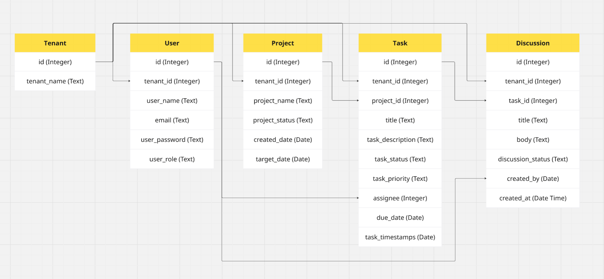
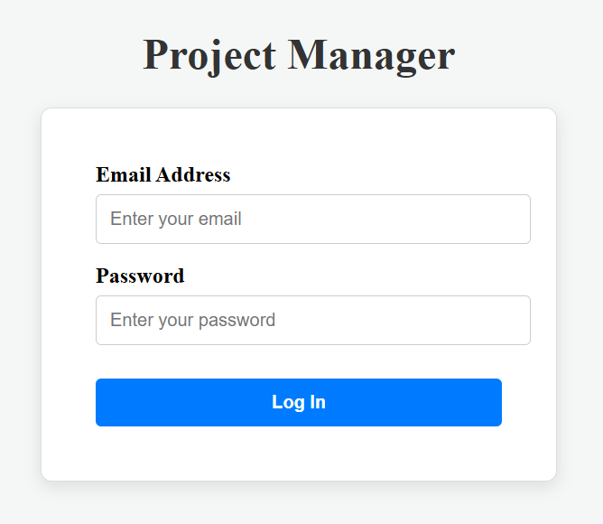
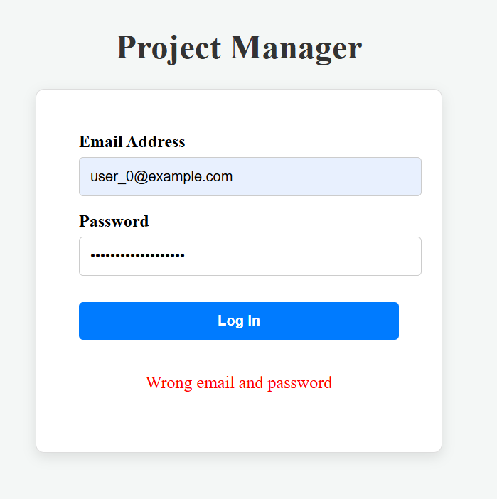
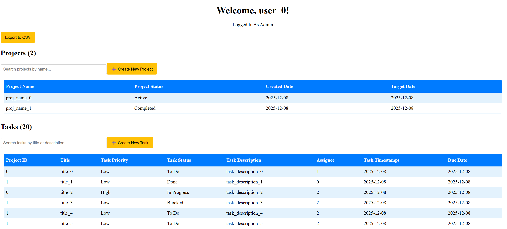
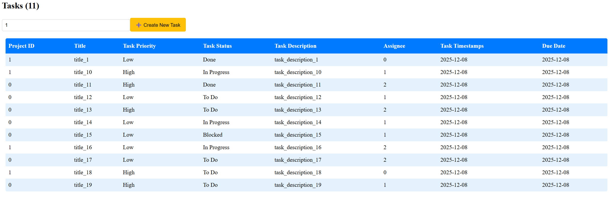
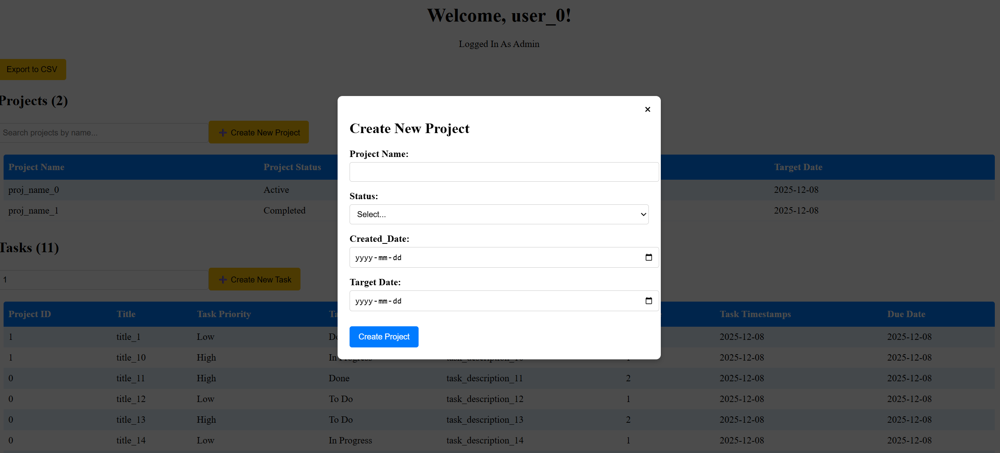
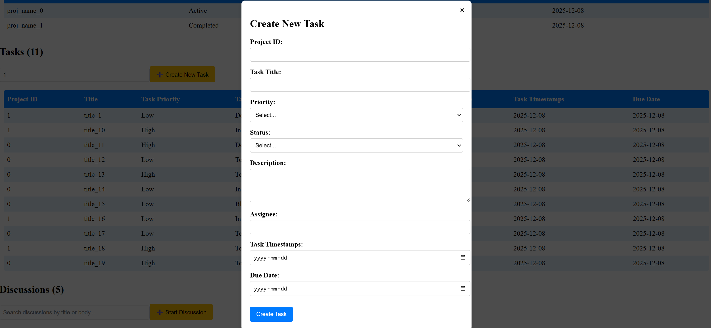
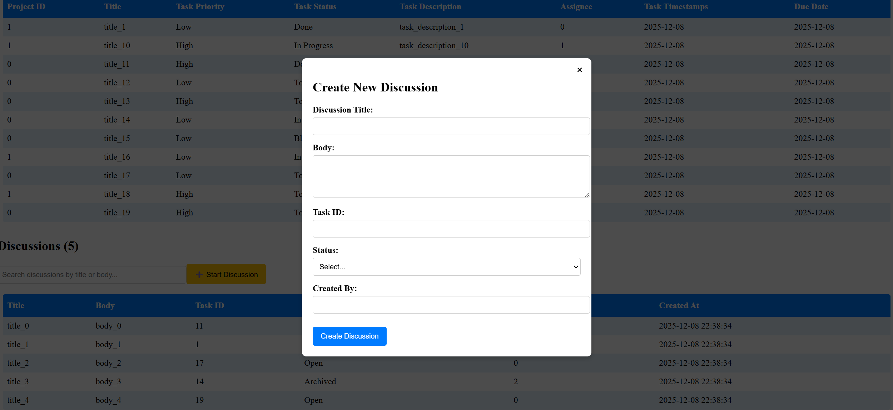
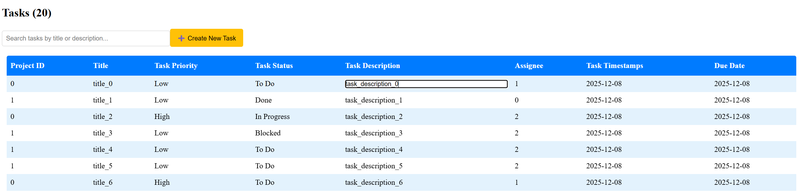
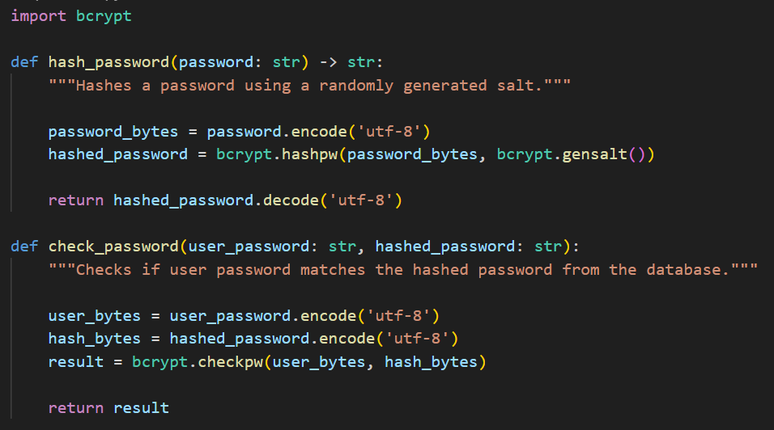

# Project Manager

## Overview

This project delivers a full-stack web application designed to provide comprehensive, integrated management of enterprise projects. It establishes a structured environment for overseeing the entire project lifecycle, from high-level planning down to granular execution details. The system organizes work hierarchically: Projects serve as the top-level containers, encapsulating specific Tasks, which in turn can host detailed Discussions to facilitate communication and decision-making among team members. The application is built using a modern, scalable architecture, featuring a Python Flask backend for robust server-side processes and data handling, utilizing SQLite for efficient, file-based persistence, and a highly interactive, responsive user interface developed with React. This setup ensures a seamless and productive experience for tracking progress, managing deliverables, and fostering collaborative work.

---

## Technical Stack

This application is built using a modern, decoupled front-end and back-end architecture:

### Frontend
* React: Used for building the user interface, providing component-based development and efficient rendering of the data-driven tables.

* JavaScript (ES6+): The primary language for client-side logic and interaction.

* CSS/Inline Styling: Utilized for presenting a clear and professional data visualization.

### Backend and Database
* Flask (Python): Serves as the lightweight backend framework, handling API requests, business logic, and database interactions.

* SQLite: The chosen database system for simple, embedded, and file-based data persistence, ideal for development and small-scale deployment.

* RESTful APIs: The communication protocol between the React frontend and the Flask backend.

---

## Installation and Setup 

To run the backend: 
```
python -m venv venv
.\.venv\Scripts\Activate.ps1
pip install -r server/requirements.txt
python src/main.py
```

To run the frontend: 
```
cd frontend-app
npm install
npm run dev
```

---

## ER Diagram

The application utilizes a relational data structure centered around a multi-tenant architecture. The core of the design is the tenant table, which serves as the parent entity for all organizational data. Each Tenant can contain multiple Users and multiple Projects. The Project table is designed to logically group related Tasks. Tasks are the fundamental unit of work, linking back to a specific Project and being assigned to a single User (assignee). Finally, the Discussion table allows for nested communication, with each discussion thread tied directly to a specific Task and created by a User (created_by). This hierarchical structure, where the tenant_id field is present in every major table, ensures strict data segregation and clear ownership across the system.





---

## Log In Page

The application includes a dedicated Login Page that serves as the access point for authenticated users. This interface features standard fields for email (or username) and password submission. For security and user experience, the system performs validation upon submission. If the user enters an incorrect password, a clear red text prompt is displayed directly on the screen to inform them of the authentication failure, guiding the user to re-enter their credentials.




---

## Dashboard

The Main Dashboard Page is the central hub for logged-in users, providing an immediate overview of their status and relevant data. At the top, it prominently displays the user's name and their currently logged-in role (e.g., 'Admin', 'Manager', or 'Contributor'), providing crucial context for their access privileges and system view.

The dashboard is organized around three primary tables that present actionable information. It provides the information on Projects, Tasks, and Discussions with specific statuses and information for each row.



---

## Search and Filter 

The application incorporates a dynamic search feature to enhance data manageability. This functionality allows users to input text into a search bar, and as they type, the system automatically filters the displayed data (such as entries in a table or list). This immediate, real-time filtering updates the content based on the user-entered query, providing a highly efficient and interactive way to locate specific records without needing to submit a separate request.



---

## New Record

The New Record feature streamlines data entry by allowing the admins and managers to instantly create new Projects, Tasks, or Discussions. When a user selects this option, a clean, modal pop-up window immediately appears over the current screen. This pop-up contains all the necessary input fields (like names, descriptions, due dates, and assignments) for the selected record type, ensuring that all required information is gathered in one focused step before the new entry is saved to the system.





---

## In line editing

The Inline Editing feature provides a fast and efficient way for users with Admin and Manager roles to update existing records. Instead of navigating to a separate edit form, users can simply click directly on the data field they wish to change (such as a task name or a project status). This action instantly converts the field into an editable input box, allowing authorized personnel to modify the record in place and save the changes with minimal interruption to their workflow.



---

## Password protection

The bcrypt Python module is used to securely store user passwords by employing a one-way hashing algorithm designed to be computationally expensive, which slows down brute-force attacks. The module's primary function, bcrypt.hashpw, takes a password and a unique, randomly generated salt (via bcrypt.gensalt()) to produce a robust hash that is safe to store in a database. When a user attempts to log in, the bcrypt.checkpw function securely verifies the provided plaintext password against the stored hash by re-hashing the input using the salt embedded within the stored hash, returning True only if they match.



---

## Export to CSV

The Export to CSV utility provides a quick way to download your core data for external analysis or reporting. By initiating this action, the system automatically queries and formats data from the projects, tasks, and discussions tables. It then generates separate CSV (Comma Separated Values) files for each table and bundles them for automatic download directly to your local drive, allowing you to easily access and manipulate the data in spreadsheet programs.

---

## Flask Backend

This Flask application serves as the backend API responsible for routing requests and managing data persistence. It uses decorators like @app.route to define specific server endpoints (e.g., /api/login, /api/data, /api/insert_projects) that handle incoming HTTP requests (like POST). The server establishes and manages a connection to a local SQLite database using sqlite3 and the get_db function, performing operations such as user authentication via the check_password utility, retrieving tenant-specific data, and inserting or updating records across the project, task, and discussion tables. It uses jsonify to return structured data as JSON responses, allowing the frontend client to interact with the application's data layer.

---

## SQL Lite3 database

The application uses SQLite as its lightweight, serverless database to handle all data persistence. Within the Flask backend, functions like get_db() manage connecting to the database.db file, ensuring a connection is available for each request and properly closed afterwards. All data operations—from retrieving tenant-specific projects, tasks, and discussions (the Read operation) to inserting new records (/api/insert_..., the Create operation) and modifying existing ones (/api/update_data, the Update operation)—are executed using SQL statements prepared via the sqlite3 library. This setup provides transactional integrity and a straightforward mechanism for data storage and retrieval.

---

## Seed Data

The seed data process involves running a Python file (create_init_data.py that creates the initialize_data.sql) that creates a set of SQL INSERT commands. This mechanism, executed by the init_db() function during application startup, populates the SQLite database tables (like user, project, task, and discussion) with an initial set of test records. This ensures that the database is not empty when the application first runs, providing necessary base users and initial sample data for immediate testing and use of the application's features before any live data is created.

---